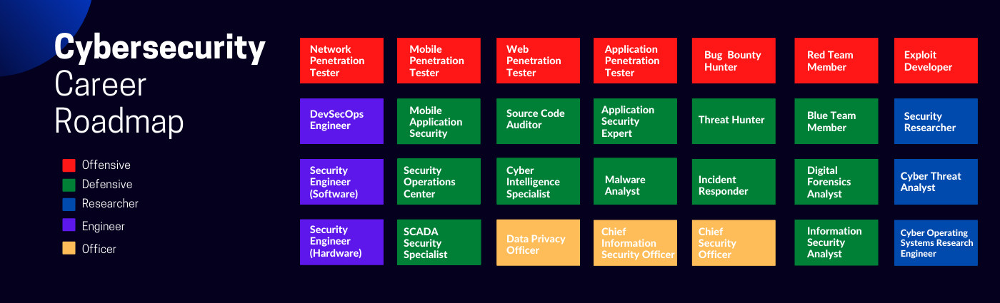

Cybersecurity Career Path ⬆️

⚠️ Not Include Responsibilities

⚠️ Education and Certification are Optional

## Offensive

* [Network Penetration Tester](https://github.com/rezaduty/security-career-path/blob/master/Network_Penetration_Tester.md)
* [Mobile Penetration Tester](https://github.com/rezaduty/security-career-path/blob/master/Mobile_Penetration_Tester.md)
* [Web Penetration Tester](https://github.com/rezaduty/security-career-path/blob/master/Web_Penetration_Tester.md)
* [Application Penetration Tester](https://github.com/rezaduty/security-career-path/blob/master/Application_Penetration_Tester.md)
* [Bug Bounty Hunter](https://github.com/rezaduty/security-career-path/blob/master/Bug_Bounty_Hunter.md)
* [Red Team Member](https://github.com/rezaduty/security-career-path/blob/master/Red-Team-Member.md)
* [Exploit Developer](https://github.com/rezaduty/security-career-path/blob/master/Exploit_Developer.md)

## Defensive

* [Mobile Application Security](https://github.com/rezaduty/security-career-path/blob/master/Mobile_Application_Security.md)
* [Source Code Auditor](https://github.com/rezaduty/security-career-path/blob/master/Source_Code_Auditor.md)
* [Application Security Expert](https://github.com/rezaduty/security-career-path/blob/master/Application_Security_Expert.md)
* [Threat Hunter](https://github.com/rezaduty/security-career-path/blob/master/Threat_Hunter.md)
* [Blue Team Member](https://github.com/rezaduty/security-career-path/blob/master/Blue-Team_Member.md)
* [Security Operation Center](https://github.com/rezaduty/security-career-path/blob/master/Security_Operation_Center.md)
* [Cyber Threat Analyst](https://github.com/rezaduty/security-career-path/blob/master/Cyber_Threat_Analyst.md)
* [Malware Analyst](https://github.com/rezaduty/security-career-path/blob/master/Malware_Analyst.md)
* [Incident Responder](https://github.com/rezaduty/security-career-path/blob/master/Incident_Responder.md)
* [Digital Forensic Analyst](https://github.com/rezaduty/security-career-path/blob/master/Digital_Forensic_Analyst.md)
* [SCADA Security Specialist](https://github.com/rezaduty/security-career-path/blob/master/SCADA_Security_Specialist.md)
* [Information Security Analyst](https://github.com/rezaduty/security-career-path/blob/master/Information_Security_Analyst.md)

## Researcher

* [Security Researcher](https://github.com/rezaduty/cybersecurity-career-path/blob/master/Security_Researcher.md)
* [Cyber Threat Analyst](https://github.com/rezaduty/cybersecurity-career-path/blob/master/Cyber_Threat_Analyst.md)
* [Cyber Operation Systems Research Engineer](https://github.com/rezaduty/cybersecurity-career-path/blob/master/Cyber_Operation_Systems_Research_Engineer.md)

## Engineer

* [DevSecOps Engineer](https://github.com/rezaduty/security-career-path/blob/master/DevSecOps_Engineer.md)
* [Security Engineer(Software)](https://github.com/rezaduty/security-career-path/blob/master/Security_Engineer(Software).md)
* [Security Engineer(Hardware)](https://github.com/rezaduty/security-career-path/blob/master/Security_Engineer(Hardware).md)

## Officer

* [Data Privacy Officer](https://github.com/rezaduty/security-career-path/blob/master/Data_Privacy_Officer.md)
* [Chief Information Security Officer](https://github.com/rezaduty/security-career-path/blob/master/Chief_Information_Security_Officer.md)
* [Chief Security Officer](https://github.com/rezaduty/security-career-path/blob/master/Chief_Security_Officer.md)

